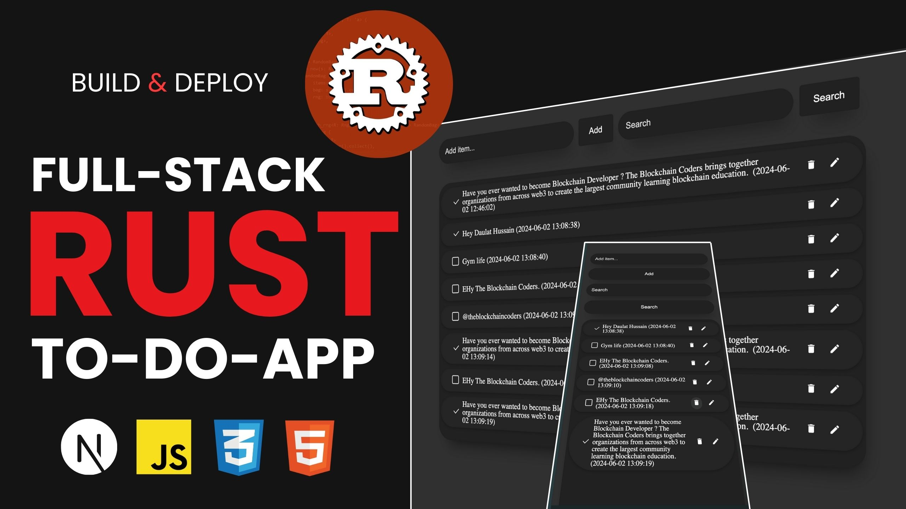

# Full-Stack To-Do List App with Rust Backend and Next.js Frontend | Rust Project

In this comprehensive tutorial, we'll guide you through building a full-stack to-do list application from scratch using Rust for the backend and Next.js for the frontend. Whether you're new to these technologies or looking to enhance your skills, this video covers everything you need to know to create a robust and efficient to-do list app.

What You'll Learn:

- Setting up a Rust backend with Actix-web
- Implementing database operations using Diesel ORM
- Creating RESTful APIs in Rust
- Building a modern frontend with Next.js and React
- Fetching data from the backend using React Query
- Managing application state and UI with Next.js

## Project Overview



## Instruction

### Install Windsurf

```https://windsurfrs.org/
  GET: Windsurf Editor
```

### INSTALL RUST

```https://nodejs.org/en/download
  RUST: curl --proto '=https' --tlsv1.2 -sSf https://sh.rustup.rs | sh
```

### INSTALL DOC

```sh
  RUST DOC: https://doc.rust-lang.org/book/
```

### PROJECT STRUCTURE

```sh
  todo_list
      ├── Cargo.toml
      └── src
          └── main.rs
```

### BUILD & RUN COMMAND (BACKEND)

```sh
 COMMAND:  cargo run
```

### FRONTEND COMMAND

```sh
 COMMAND:  npx run
```

### INSTALL EXTENSION

```sh
 COMMAND:  rust-analyzer
```

### PACKAGES

```sh
    [package]
      name = "todo-backend"
      version = "0.1.0"
      edition = "2018"

      [dependencies]
      actix-web = "4"
      actix-cors = "0.6"
      serde = { version = "1.0", features = ["derive"] }
      uuid = { version = "1.0", features = ["serde", "v4"] }
      chrono = { version = "0.4", features = ["serde"] }
```
